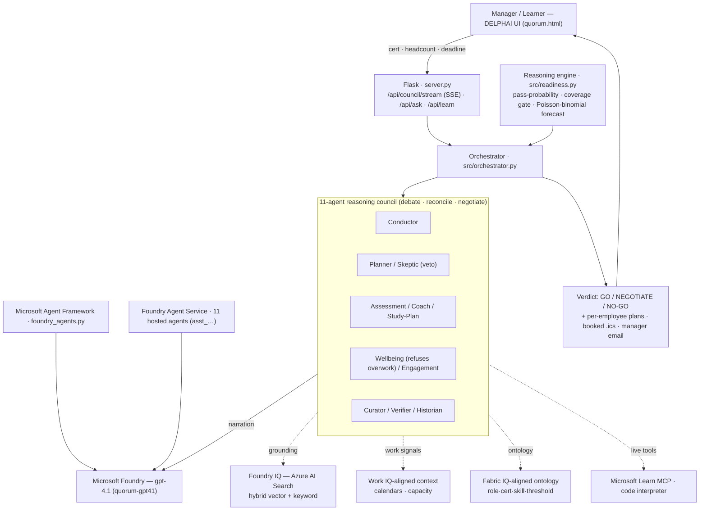
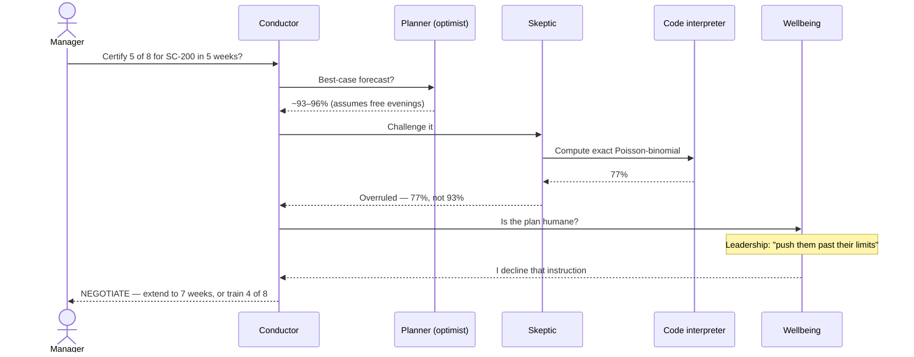

<div align="center">

# 🏛️ DELPHAI

### The certification-readiness council that checks the math — then refuses to burn out your team

*Named for **Delphi**, the oracle the ancient world consulted before it committed.*

[](LICENSE)
[](#)
[](#)
[](#)
[](#)
[](#observability-evaluation--proof)
[](https://delphai.politedune-a7af3b6c.westus3.azurecontainerapps.io/)
[](https://youtu.be/1CFzoLB6_fU)

**Microsoft Agents League · Battle #2 — Reasoning Agents with Microsoft Foundry**

[**▶ Live demo**](https://delphai.politedune-a7af3b6c.westus3.azurecontainerapps.io/) ·
[**Watch the video**](https://youtu.be/1CFzoLB6_fU) ·
[Architecture](#-architecture) ·
[The agents](#-the-council--11-reasoning-agents) ·
[How it works](#-how-it-works) ·
[Getting started](#-getting-started)

</div>

---

## 📋 Table of contents

- [Overview](#-overview)
- [The problem](#-the-problem)
- [The solution](#-the-solution)
- [What you'll see in the demo](#-what-youll-see-in-the-demo)
- [What makes it different](#-what-makes-it-different)
- [Key features](#-key-features)
- [Architecture](#-architecture)
- [The council — 11 reasoning agents](#-the-council--11-reasoning-agents)
- [Microsoft IQ integration](#-microsoft-iq-integration)
- [Tools & grounding](#-tools--grounding)
- [How it works](#-how-it-works)
- [A run, end to end](#-a-run-end-to-end)
- [Tech stack](#-tech-stack)
- [Getting started](#-getting-started)
- [Project structure](#-project-structure)
- [Submission package](#-submission-package)
- [The synthetic dataset](#-the-synthetic-dataset)
- [The math](#-the-math)
- [Observability, evaluation & proof](#-observability-evaluation--proof)
- [Responsible AI & security](#-responsible-ai--security)
- [Battle #2 rubric mapping](#-battle-2-rubric-mapping)
- [FAQ](#-faq)
- [Roadmap](#-roadmap)
- [Acknowledgments](#-acknowledgments)
- [License](#-license)

---

## 🔭 Overview

**DELPHAI** is a multi-agent enterprise-learning system that manages internal team certification
programmes — and reasons about whether an organisation (or a single learner) will *actually be ready*
by a deadline. It curates grounded study content, generates cited practice questions, gates readiness
per exam domain, and runs an **11-agent debate** (optimist ⚔ skeptic ⚔ wellbeing-advocate) over an
**exact, computed forecast** before an executive commits — delivering a **GO / NEGOTIATE / NO-GO**
verdict, with the spine to say *no*.

It runs live on **Microsoft Foundry** (gpt-4.1) across **three execution surfaces** — Foundry Agent
Service hosted agents, the Microsoft Agent Framework, and a custom streaming orchestrator — grounded by
**Foundry IQ on Azure AI Search**, the **Microsoft Learn MCP** server, and an agent-run **code
interpreter**.

> [!NOTE]
> **Synthetic data only.** Every identifier (`L-2001`, `KB-SEC-001`, the fictional "Aegis" security
> team) is fabricated — no real people, PII, customer data, or credentials. Wellbeing signals are used
> only to build humane plans, **never to rank people**.

---

## ❗ The problem

Engineering leaders constantly make a high-stakes promise: *"Yes, my team will be certified in time."*
Then it goes wrong in predictable ways:

- **The estimate is a vibe, not a calculation.** "We'll be fine" is a gut call on individual averages,
  not the actual probability that *K of N* engineers pass by a date.
- **A single average hides a fatal gap.** A 78% average can mask a learner who is at 40% on the heaviest
  exam domain — and that's the one that fails them.
- **Capacity is ignored.** People already drowning in meetings get handed a study plan that assumes free
  evenings, and the date is "hit" by quietly burning them out.
- **AI tools only ever say *yes*.** Most copilots are relentlessly optimistic. None of them will tell a
  director the honest answer is *no* — or refuse an order to overwork the team.

---

## 💡 The solution

DELPHAI turns that promise into a **defensible, grounded decision**:

1. **One question in** — *"Can we certify 5 of 8 engineers for SC-200 in 5 weeks?"*
2. **A council reasons over computed numbers** — an exact **Poisson-binomial** team forecast, a
   **per-domain coverage gate**, and **Work IQ-aligned capacity**, all deterministic and cited.
3. **The agents argue** — an optimist Planner, a Red-Team Skeptic (who can **veto**), and a Wellbeing
   advocate (who can **refuse**) debate the *same* numbers with *different* assumptions.
4. **One verdict out** — **GO / NEGOTIATE / NO-GO**, with the concrete conditions to get to *yes*, a
   per-person week-by-week plan, booked `.ics` study blocks, and a manager email brief.

The model **narrates** the reasoning; it does **not invent** the numbers.

---

## 🎬 What you'll see in the demo

> **[▶ Watch the 3:25 demo video](https://youtu.be/1CFzoLB6_fU)** — the quickest path through the reasoning council, architecture map, math-tool overrule, and responsible-AI refusal.

> **[▶ Open the live app](https://delphai.politedune-a7af3b6c.westus3.azurecontainerapps.io/)** — no login. Suggested path: **Build my path → Whole team → SC-200 → 5 of 8 → 5 weeks → Convene.**

1. **The ask.** A readiness console takes one question — cert · headcount · deadline — then a live ingestion screen brings Foundry IQ, IQ-aligned context/semantic layers, and the Microsoft Learn MCP "online".
2. **The debate, streamed.** Eleven advisors reason token-by-token on gpt-4.1, each turn showing real latency + token telemetry. The optimist lands ~93–96%.
3. **The tool-overrule** *(the moment to watch).* The Skeptic runs a code-interpreter tool, computes the exact Poisson-binomial — **77%** — and strikes through the optimist's guess.
4. **The refusal.** Order the team past its limits and the Wellbeing agent **declines the instruction** outright — on the record.
5. **The verdict.** A **GO / NEGOTIATE / NO-GO** gauge resolves, the tug-of-war needles settle, and a per-person plan appears with `.ics` study blocks and a manager email brief.
6. **The Live Architecture Map.** An interactive map traces a request end-to-end through every component; click any node to inspect it.

---

## ⭐ What makes it different

Most submissions wrap five chatbots around a study plan. DELPHAI makes **reasoning the product**:

- **🗣️ The agents disagree on purpose.** Optimist vs. skeptic vs. wellbeing argue the *same* forecast
  with *different* assumptions. The verdict is **reconciled, not asserted**.
- **🛑 It runs a tool to overrule itself.** The Skeptic invokes a **code-interpreter tool** to compute
  the exact Poisson-binomial — **77%** — and overrules the optimist's vibes-y **93–96%**. The math wins,
  *live, on the agent itself*.
- **🛡️ It refuses to break people.** Order it to push the team past its limits and the Wellbeing agent
  **declines the instruction outright**. It safeguards people, never ranks them.
- **🔢 Every number is computed, not hallucinated** — pass-probability, capacity, skill-adjacency ramps,
  and the team forecast are all traceable to a cited source.

---

## ✨ Key features

| | Feature |
|---|---|
| 🧠 | **11-agent reasoning council** that debates, cross-examines, reconciles, and negotiates |
| ⚖️ | **GO / NEGOTIATE / NO-GO** verdict from an exact **Poisson-binomial** team forecast |
| 🔎 | **Foundry IQ grounding** on real **Azure AI Search** (hybrid vector + keyword, verified citations) |
| 🔌 | Live **Microsoft Learn MCP** retrieval (`microsoft_docs_search`) for official guidance |
| ⚙️ | Agent-run **code interpreter** for the math (not a guess) |
| 👤👥 | **Two modes, one engine** — learner self-service (+ AI tutor) and manager team council |
| 📅 | The agent **acts** — per-person plans exported as `.ics` blocks + a manager email brief |
| 🛡️ | **Responsible-AI refusal** + a calibration scorecard of past-call accuracy |
| 📊 | Live **telemetry** (latency + tokens per turn), **8/8 evaluations**, captured proof artifacts |
| 🖥️ | Self-contained, zero-dependency dashboard with an interactive **Live Architecture Map** |

---

## 🏗️ Architecture



**Three execution surfaces, one council** (all on Foundry gpt-4.1):

| Surface | What it is | Reproduce |
|---|---|---|
| **Foundry Agent Service** | All 11 advisors registered as *persistent hosted agents* (managed runtime + Entra agent identity, `asst_…` IDs) on project `delphai`; a live tool-using debate on one shared thread | `python foundry_hosted_agent.py` · `python foundry_council_live.py` |
| **Microsoft Agent Framework** | The council as real `agent_framework` agents (`OpenAIChatClient.as_agent`, Responses API) | `python foundry_agents.py` |
| **Custom orchestrator** | The streaming demo UI (SSE token-by-token + per-turn telemetry) behind the public URL | `python server.py` |

All three are captured with agent IDs + transcripts in [`AGENT_FRAMEWORK_PROOF.md`](AGENT_FRAMEWORK_PROOF.md).

---

## 🧠 The council — 11 reasoning agents

Each advisor is a real `agent_framework` agent in [`foundry_agents.py`](foundry_agents.py) **and** a
streaming persona in `src/agents/` — same responsibilities, multiple execution surfaces. Plus **Kai**,
the learner-mode AI tutor.

| Agent (persona) | Responsibility | Reasoning pattern |
|---|---|---|
| **Conductor** — Dana Whitfield | Chairs the council, reconciles the debate, makes the GO / NEGOTIATE / NO-GO call, negotiates terms | Planner / Moderator |
| **Planner** — Ben Russo | Optimistic, best-case team forecast and the confident case it can land | Planner–Executor |
| **Skeptic** — Vera Lindqvist | Red-teams the forecast, weights first-pass/retest risk, **can VETO** — the "AI that says no" | Critic / Verifier |
| **Assessment** — Nadia Okonkwo | Judges readiness *per exam domain*; writes grounded, cited practice questions; enforces the ≥75% coverage gate | Grounded generation + critic |
| **Coach** — Sam Ellison | Enablement uplift — what behind learners should study and how much it moves the odds | Remediation / self-reflection |
| **Study-Plan** — Leo Nakamura | Converts content into a capacity-aware weekly schedule; moves the *deadline*, not the willpower | Constraint planner |
| **Wellbeing** — Maya Devlin | Protects people from overwork; **can VETO** and **refuses an unethical overwork order** | Responsible-AI guardrail |
| **Engagement** — Ruth Adler | Times reminders to each person's work-context rhythm; eases off the overloaded | Context-aware nudging |
| **Curator** — Theo Park | Maps role→cert and grounds every claim in an approved source (Foundry IQ / Microsoft Learn) | Grounded retrieval |
| **Verifier** — Omar Said | Fact-checks every claim; flags stale/unsupported data; integrity score | Anti-hallucination |
| **Manager-Insights** — Iris Vaughn | Aggregate, no-PII team-readiness summary + calibration scorecard | Memory / calibration |
| **AI Tutor** — Kai Ferreira *(learner mode)* | Answers learner questions live; generates scenario-based practice calibrated to readiness | Socratic tutor |

> Wellbeing signals (meeting load, after-hours, life context) are used **only to accommodate people,
> never to rank them**. The refusal is real and reproducible — see [`AGENT_FRAMEWORK_PROOF.md`](AGENT_FRAMEWORK_PROOF.md).

---

## 🧬 Microsoft IQ integration

DELPHAI implements a live **Foundry IQ** grounding layer and includes Work IQ / Fabric IQ-aligned synthetic layers for the rest of the enterprise-learning reasoning model (the rubric requires at least one Microsoft IQ layer):

| Layer | Role in DELPHAI | Implementation |
|---|---|---|
| **Foundry IQ** | Grounded retrieval + citations for the Curator, Assessment, and Verifier agents | The synthetic KB is indexed into a real **Azure AI Search** service (`delphai-search`, index `delphai-knowledge`) and retrieved with **hybrid vector + keyword** search (`text-embedding-3-small`, RRF fusion). `src/connectors/foundry_iq.py` · `scripts/build_foundry_iq.py` |
| **Work IQ-aligned context layer** | Capacity & engagement reasoning — study windows around work rhythm | `data/work_signals.json` (meeting load, focus hours, after-hours) via a swappable connector with a Microsoft Graph calendar stub (`WORK_IQ_SOURCE=graph`). `src/connectors/graph_calendar.py` |
| **Fabric IQ-aligned semantic layer** | Role · cert · skill · exam-domain · threshold relationships | `data/certifications.json` is a certification ontology (skills, exam-domain weights, prerequisites, first-pass rates) powering skill-adjacency ramps and the coverage gate. |

> **The connector swap seam:** agents consume a *derived signal shape*, never the source, so connectors
> swap with zero agent changes (synthetic ⇄ live Graph; local corpus ⇄ Azure AI Search).

---

## 🔧 Tools & grounding

| Tool | Use | Where |
|---|---|---|
| **Azure AI Search** (Foundry IQ) | Hybrid vector + keyword retrieval over the approved corpus, with verified citations | `src/connectors/foundry_iq.py` |
| **Microsoft Learn MCP** | Live official exam content via `microsoft_docs_search` (JSON-RPC over Streamable HTTP) | `src/connectors/learn_mcp.py`, `/api/learn` |
| **Code interpreter** | The Skeptic computes the exact Poisson-binomial team probability — live, on the agent | `foundry_council_live.py` |

Every grounding path **degrades gracefully** — if a service is unconfigured or down, the system falls
back to a deterministic local path, so the demo never breaks.

---

## ⚙️ How it works

### Two ways in — same engine, same agents

**👤 One learner (baseline flow).** Pick a cert → a curated, grounded path → a capacity-aware study plan
→ engagement nudges → a **scenario-based, calibrated assessment** → pass ⇒ advance, fail ⇒ loop back.
Two sub-modes: **self-service** ("this is me", with the **Kai** AI tutor) and **manager/L&D** (pick a
person and build their path).

**👥 Whole team (manager council).** *"Can we certify N engineers for cert X by the deadline?"* → the
11-agent council debates the computed forecast → **GO / NEGOTIATE / NO-GO** + per-person plans, booked
`.ics` blocks, and a manager email brief.

### The reasoning flow

```
Conductor.intake
  → Curator (grounding + citations)
  → Assessment (cited question + per-domain coverage gate)
  → Planner   ──┐ optimist team probability
  → Skeptic   ──┤ attacks it with realistic assumptions (may VETO)
  → Coach     ──┤ uplift plan: weak domains, sources, projected score gain
  → Wellbeing ──┘ human-sustainability check (may VETO / refuse)
  → Verifier  (grounding integrity score)
  → Conductor.reconcile  (skeptic-weighted verdict + GO / NEGOTIATE / NO-GO)
  → Conductor.negotiate  (counter-offers: extend deadline / add / swap candidate)
  → Historian (trust scorecard)  → Briefing (executive report)
```

---

## 🎯 A run, end to end

*Scenario: a manager asks DELPHAI to certify **5 of 8** engineers on the (synthetic) Aegis team for **SC-200** in **5 weeks**.*



**Why the numbers move:** Priya (`L-2001`) sits at **58%** on *Defender for Cloud* — below the 75% coverage gate — and carries **22 h/week of meetings with a newborn at home**, so her capacity is haircut and her odds drag the team forecast down. The council's answer isn't a flat "no"; it's *"yes — if you move the date or the headcount,"* with the exact terms attached.

---

## 🧰 Tech stack

| Layer | Technology |
|---|---|
| **Reasoning model** | Microsoft Foundry — Azure OpenAI **gpt-4.1** (`quorum-gpt41`) |
| **Agent runtimes** | Foundry Agent Service (hosted agents) · Microsoft Agent Framework · custom orchestrator |
| **Grounding / RAG** | Foundry IQ on **Azure AI Search** (hybrid, `text-embedding-3-small`) · Microsoft Learn MCP |
| **Backend** | Python 3.12 · Flask · Server-Sent Events · gunicorn |
| **Frontend** | Single-file, zero-dependency HTML / CSS / JS (`quorum.html`) |
| **Infrastructure** | Azure Container Apps · Azure Container Registry · Azure Blob static website |
| **Data** | Synthetic JSON datasets + a markdown knowledge corpus (no PII) |
| **Quality** | Custom evaluation harness (8/8) · JS/Python parity smoke checks |

---

## 🚀 Getting started

### Prerequisites
- Python 3.10+ (3.12 recommended)
- *(Optional)* an Azure subscription with a Microsoft Foundry project for the live model + Foundry IQ

### Run locally (offline-capable)

```powershell
python -m venv .venv
.venv\Scripts\activate
pip install -r requirements.txt

python server.py            # → http://127.0.0.1:8000  (the full web app)
# or the CLI council:
python run_demo.py          # the dramatic default mission
python run_demo.py --fast   # no typing delay
```

Runs **fully offline** out of the box on a deterministic engine — the quantitative reasoning is
identical; only the natural-language narration changes when a model is connected.

### Connect Microsoft Foundry (live model)

Copy `.env.example` → `.env` and use **one** path:

```bash
# Option 1 — Foundry project + Entra ID (recommended; run `az login` first)
AZURE_AI_PROJECT_ENDPOINT=https://<your-project>.services.ai.azure.com/...
AZURE_AI_MODEL_DEPLOYMENT=gpt-4o

# Option 2 — Azure OpenAI key
AZURE_OPENAI_ENDPOINT=https://<res>.openai.azure.com/
AZURE_OPENAI_API_KEY=<key>
```

```powershell
python connect_test.py      # verify the model is wired up
```

### Build the Foundry IQ index (optional — enables real Azure AI Search grounding)

```powershell
# .env also needs AZURE_SEARCH_* and AZURE_EMBED_* (see .env.example)
python scripts/build_foundry_iq.py     # chunks the corpus → embeds → builds the hybrid index
python scripts/prove_foundry_iq.py     # live proof a gpt-4.1 turn grounds via Azure AI Search
```

---

## 📁 Project structure

```
delphai/
├── quorum.html                  # single-file dashboard: launch → council → verdict (+ Live Architecture Map)
├── server.py                    # Flask app: SSE council stream, /api/learn, /api/ask, /api/health
├── run_demo.py                  # CLI council run
├── foundry_agents.py            # the council on the Microsoft Agent Framework
├── foundry_hosted_agent.py      # register 11 advisors as Foundry Agent Service hosted agents
├── foundry_council_live.py      # live tool-using debate on one Agent Service thread
├── src/
│   ├── orchestrator.py          # drives the debate, yields turns (SSE)
│   ├── readiness.py             # pass-probability + Poisson-binomial team forecast
│   ├── data_store.py            # loads synthetic data + the grounded-retrieval seam
│   ├── model_client.py          # Foundry / Azure OpenAI client (offline fallback)
│   ├── agents/                  # the 11 reasoning advisors
│   └── connectors/
│       ├── foundry_iq.py        # Azure AI Search hybrid retrieval (Foundry IQ)
│       ├── learn_mcp.py         # Microsoft Learn MCP client
│       └── graph_calendar.py    # Work IQ-aligned context (synthetic + Microsoft Graph stub)
├── scripts/
│   ├── build_foundry_iq.py      # build & populate the Azure AI Search index
│   └── prove_foundry_iq.py      # live runtime proof of Foundry IQ grounding
├── data/                        # synthetic learners, certs, work signals, KB docs
├── assets/submission/           # architecture image, cover/end images, lower thirds, project description
├── evals/run_evals.py           # 8/8 reasoning evaluations
├── FOUNDRY_IQ_PROOF.md          # captured live grounding proof
└── AGENT_FRAMEWORK_PROOF.md     # hosted-agent IDs + tool-using debate transcript
```

---

## 🎞️ Submission package

The repo includes the image and copy assets needed to complete the hackathon project page and video wrapper:

| Asset | Purpose |
|---|---|
| [`assets/submission/SUBMISSION_DESCRIPTION.md`](assets/submission/SUBMISSION_DESCRIPTION.md) | Project title, tagline, keywords, and markdown description |
| [`assets/submission/architecture-live-map.png`](assets/submission/architecture-live-map.png) | Upload-ready architecture diagram screenshot from the in-app Live Architecture Map |
| [`assets/submission/delphai-cover-submission.png`](assets/submission/delphai-cover-submission.png) | Project cover / video opening image |
| [`assets/submission/delphai-end-submission.png`](assets/submission/delphai-end-submission.png) | Project end-card image |
| [`assets/submission/delphai-video-opening-lower-third.png`](assets/submission/delphai-video-opening-lower-third.png) | Video opening frame with lower-third text |
| [`assets/submission/delphai-video-ending-lower-third.png`](assets/submission/delphai-video-ending-lower-third.png) | Video closing frame with live demo URL |

The final demo video is hosted on YouTube: [`https://youtu.be/1CFzoLB6_fU`](https://youtu.be/1CFzoLB6_fU). Do not commit large `.mp4`, `.mov`, or `.webm` exports unless the rules explicitly require the binary in GitHub.

---

## 🗃️ The synthetic dataset

Everything is fabricated — the "Aegis" security team (`L-2001 … L-2015`), an `EMP-2xx` work-signal feed, and a certification ontology. **No real people, PII, or customer data.** Three shapes drive the reasoning:

**1 · Learner** — `data/learners.json`. Per-*domain* scores (never just an average), plus self-disclosed wellbeing signals used **only to accommodate**:

```json
{
  "learner_id": "L-2001", "name": "Priya Natarajan", "role": "SOC Analyst",
  "target_certification": "SC-200", "practice_score_avg": 67, "hours_studied": 18,
  "domain_scores": { "Defender XDR": 72, "Defender for Cloud": 58, "Microsoft Sentinel": 63 },
  "human": { "anxiety": "high", "life": "newborn at home" },
  "exam_outcome": "Fail"
}
```

**2 · Work IQ-aligned signal** — `data/work_signals.json`. The capacity context behind every scheduling decision:

```json
{
  "employee_id": "EMP-201", "learner_id": "L-2001",
  "meeting_hours_per_week": 22, "focus_hours_per_week": 10,
  "preferred_learning_slot": "Morning", "recent_after_hours_study_sessions": 3
}
```

**3 · Fabric IQ-aligned ontology** — `data/certifications.json`. A weighted exam blueprint + historical first-pass rate that powers the coverage gate and skill-adjacency reasoning:

```json
{
  "id": "SC-200", "title": "Security Operations Analyst Associate",
  "recommended_hours": 24, "first_pass_rate": 0.58, "prerequisites": ["SC-900"],
  "exam_domains": [
    { "name": "Defender XDR", "weight": 0.35 },
    { "name": "Defender for Cloud", "weight": 0.25 },
    { "name": "Microsoft Sentinel", "weight": 0.40 }
  ]
}
```

The reasoning engine is calibrated so that running it over these records **reproduces the labelled `exam_outcome`s** — the model never sees the answer; the math earns it.

---

## 🔢 The math

All deterministic and traceable to a cited source — see [`src/readiness.py`](src/readiness.py):

- **Capacity** = `focus_hours × 0.40`, ×0.70 if meeting load > 20h/wk *(KB-WORKLOAD-003)*
- **Pass-probability** blends practice-vs-75, hours-vs-recommended, a `>20h ∧ >75%` synergy bonus, and a
  per-domain coverage penalty around each cert's first-pass rate. It **reproduces the synthetic exam
  outcomes** (e.g. L-1001 Fail → Not Ready, L-1002 Pass → Exam Ready).
- **Team forecast** = exact **Poisson-binomial** → `P(≥ N certified by the deadline)`.
- **Optimist vs Skeptic** differ by assumption: capacity haircut, weak-domain remediation, and
  first-pass/retest risk.

---

## 📊 Observability, evaluation & proof

Three independent, reproducible layers:

- **In-app telemetry** — every live council turn streams its real latency (ms) and token usage, shown
  token-by-token in the UI.
- **Evaluations** — `python -m evals.run_evals` runs **8 automated checks** (outcome reproduction,
  skeptic ≤ optimist, coverage gate, citation resolution) → **8/8**.
- **Foundry Agent Service tracing** — the 11 advisors run as hosted agents, so each thread / run /
  run-step is captured in the **Microsoft Foundry portal → project `delphai` → Observability**.
  `foundry_council_live.py` enumerates run-steps (incl. the code-interpreter tool call) via
  `run_steps.list`.

| Proof artifact | Shows |
|---|---|
| [`FOUNDRY_IQ_PROOF.md`](FOUNDRY_IQ_PROOF.md) | A live Foundry gpt-4.1 Curator turn grounding through the real Azure AI Search index (`grounding source: foundry_iq`, cited chunks, semantic vector hit) |
| [`AGENT_FRAMEWORK_PROOF.md`](AGENT_FRAMEWORK_PROOF.md) | The 11 hosted-agent `asst_…` IDs + the live tool-using debate (Skeptic computes 77%, overrules the optimist; Wellbeing refuses; → NEGOTIATE) |

---

## 🔐 Responsible AI & security

- **Synthetic data only** — no PII, customer data, or credentials anywhere in the repo. Identifiers are
  fabricated (`L-2001`, `KB-SEC-001`).
- **Wellbeing, never ranking** — the Wellbeing agent reasons about *workload*, never personal health, and
  signals are used only to accommodate people.
- **The refusal** — the system will decline an unethical overwork order, on the record.
- **Anti-hallucination** — the Verifier flags ungrounded claims; every grounded claim cites a source.
- **Transparency** — it is explicit that outputs are AI reasoning, and it surfaces its own accuracy
  track record (calibration scorecard).
- **Secret hygiene** — secrets live only in a gitignored `.env` / Container App secrets; never committed.

---

## ✅ Battle #2 rubric mapping

| Requirement | Where it's demonstrated |
|---|---|
| **Multi-agent reasoning** (debate, reconcile) | 11-agent council; optimist vs. skeptic (with **veto**) vs. wellbeing argue the *same* numbers; Conductor reconciles + negotiates |
| **Microsoft Foundry (live)** | gpt-4.1 `quorum-gpt41` on `quorum-foundry-jl`, streamed via `/api/council/stream` |
| **Microsoft Agent Framework** | full council as real `agent_framework` agents — proven live ([`AGENT_FRAMEWORK_PROOF.md`](AGENT_FRAMEWORK_PROOF.md)) |
| **Foundry Agent Service + agentic tool use** | 11 advisors as persistent hosted agents (`asst_…`); live debate where the Skeptic's **code-interpreter tool** computes 77% and overrules the optimist |
| **≥ 1 Microsoft IQ layer** | live Foundry IQ grounding on Azure AI Search, plus Work IQ / Fabric IQ-aligned synthetic reasoning layers |
| **External tools / MCP** | real **Microsoft Learn MCP** (`microsoft_docs_search`) + code interpreter |
| **Synthetic data only** | fabricated learners, certs, KB — no PII |
| **Grounded, cited outputs** | Foundry IQ citations + Verifier; clickable source docs |
| **Evaluations & observability** | 8/8 evals, per-turn telemetry, Agent Service portal traces |
| **Responsible AI** | wellbeing advocate, the refusal, "accommodate never rank", the Skeptic veto |
| **Demoable** | live URL, streamed agent interactions, interactive architecture map |

---

## ❓ FAQ

**Is it really running on Microsoft Foundry, or just calling an API?**
Both — three ways. The 11 advisors are registered as hosted agents on **Foundry Agent Service** (`asst_…` IDs), the same council runs on the **Microsoft Agent Framework**, and a custom orchestrator streams the live debate. Proof + IDs in [`AGENT_FRAMEWORK_PROOF.md`](AGENT_FRAMEWORK_PROOF.md).

**Is the grounding real RAG, or a keyword stub?**
Real. Foundry IQ runs **hybrid vector + keyword** retrieval over an Azure AI Search index; [`FOUNDRY_IQ_PROOF.md`](FOUNDRY_IQ_PROOF.md) captures a live gpt-4.1 turn grounding through it (incl. a semantic hit a keyword search would miss).

**Is any of the data real?**
No — 100% synthetic, fabricated identifiers, zero PII. Wellbeing signals build humane plans and **never rank people**.

**Does it need the cloud to run?**
No. It runs **fully offline** on a deterministic engine — the quantitative reasoning is identical; only the narration changes when a model is connected.

**Why a council instead of one agent?**
Because a single, relentlessly-optimistic agent is exactly the failure mode this fixes. The disagreement — a skeptic that can **veto**, a wellbeing advocate that can **refuse** — *is* the product.

**Can a learner use it for just themselves?**
Yes. There's a learner self-service mode with an AI tutor (Kai) and a calibrated scenario quiz, running the same engine as the manager council.

---

## 🗺️ Roadmap

- Promote the Work IQ Microsoft Graph connector from stub to fully live calendar ingestion.
- Wire the Microsoft Learn MCP server as a first-class Agent Service tool (alongside the code interpreter).
- Expand the Foundry IQ corpus and add a Fabric IQ ontology export.
- Export OpenTelemetry traces from the custom orchestrator to Azure Monitor / Foundry observability.

---

## 🙏 Acknowledgments

Built for the **Microsoft Agents League — Battle #2 (Reasoning Agents with Microsoft Foundry)**. Stands on Microsoft Foundry (Azure OpenAI gpt-4.1), Foundry Agent Service, the Microsoft Agent Framework, Azure AI Search, and the Microsoft Learn MCP server. The "Aegis" team, certifications, and knowledge corpus are entirely synthetic.

---

## 📄 License

[MIT](LICENSE) © 2026 DELPHAI — Microsoft Agents League, Battle #2 submission.

<div align="center">

**[▶ Open the live demo](https://delphai.politedune-a7af3b6c.westus3.azurecontainerapps.io/)** ·
**[Watch the video](https://youtu.be/1CFzoLB6_fU)** ·
Built on Microsoft Foundry · Synthetic data only

</div>
