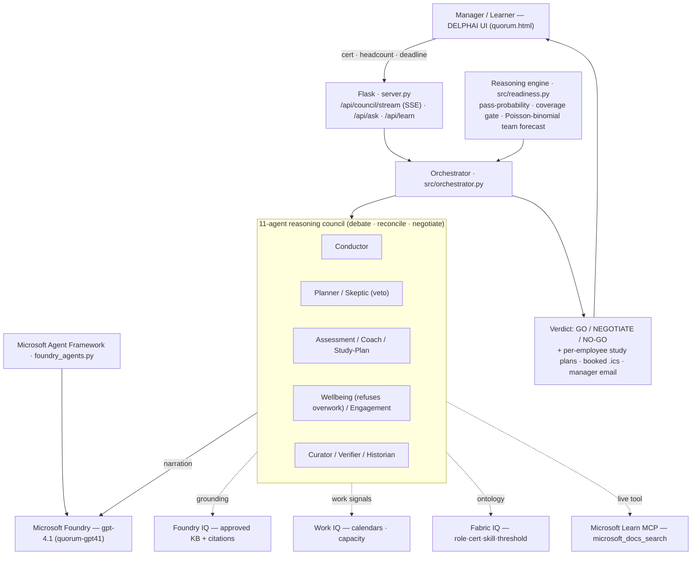

# DELPHAI — Certification-Readiness Reasoning Council

**Agents League · Battle #2 — Reasoning Agents with Microsoft Foundry**

> *Named for **Delphi**, the oracle the ancient world consulted before it committed.*

DELPHAI is a multi-agent enterprise-learning system that manages internal team certification
programmes — and reasons about whether the organisation (or one learner) will *actually be ready* by a
deadline. It curates grounded study content, generates cited practice questions, gates readiness per
exam domain, and runs an **11-agent debate** (optimist ⚔ skeptic ⚔ wellbeing-advocate) over an exact,
computed forecast before an executive commits — delivering **GO / NEGOTIATE / NO-GO**, with the spine
to say *no*.

> **Synthetic data only.** Every identifier (`L-2001`, `KB-SEC-001`, the "Aegis"
> security delivery team) is fabricated. No real people, PII, customer data, or
> credentials. Wellbeing signals are used only to build humane plans — never to rank
> people. See `data/`.

---

## Live demo

| | URL | Notes |
|---|---|---|
| **Live (gpt-4.1)** | https://delphai.wittyocean-5b0d21f3.westus3.azurecontainerapps.io/ | Real Microsoft Foundry council, streamed token-by-token, telemetry + live Microsoft Learn. **Open — no login.** |
| **Static** | https://quorum52819.z20.web.core.windows.net/ | Self-contained, no backend, **no password** — deterministic engine + scripted council. Best for a quick judge look. |
| **Agent Framework run** | `python foundry_agents.py` | The council as real Microsoft Agent Framework agents on Foundry. Captured transcript: [`AGENT_FRAMEWORK_PROOF.md`](AGENT_FRAMEWORK_PROOF.md). |
| **Live debate on Agent Service** | `python foundry_council_live.py` | The **hosted agents** deliberate on one Agent Service thread; the Skeptic computes the Poisson-binomial via a **code-interpreter tool** and overrules the optimist; Wellbeing **refuses** an overwork order. |

**Run locally:** put your Foundry endpoint/key in `.env`, then `python server.py` → http://127.0.0.1:8000.
Without a model it falls back to the deterministic engine (offline). Tests: `node` smoke checks + `python -m evals.run_evals` (8/8).

The dashboard (`quorum.html` — "QUORUM") is one self-contained file: a launch console
(cert · headcount · deadline) → live data ingestion → a **council roundtable streamed from
gpt-4.1**, a **GO / NEGOTIATE / NO-GO** verdict gauge, per-candidate risk cards, live Microsoft
Learn, clickable grounded sources, and an exportable brief.

---

## Architecture



## How it meets the Battle #2 rubric

| Requirement | Where it's demonstrated |
|---|---|
| **Reasoning agents** — multi-step, debate, reconcile | 11-agent council; optimist vs. skeptic (with **veto**) vs. wellbeing argue the *same* numbers; Conductor reconciles + negotiates. `src/orchestrator.py`, `src/agents/`, `foundry_agents.py` |
| **Microsoft Foundry (live)** | gpt-4.1 deployment `quorum-gpt41` on resource `quorum-foundry-jl`; streamed via `/api/council/stream`. `src/model_client.py`, `server.py` |
| **Microsoft Agent Framework** | the full council runs as real `agent_framework` agents backed by Foundry — each advisor an `OpenAIChatClient.as_agent`, incl. the Wellbeing advocate **refusing** an overwork order. **Proven live** — see [`AGENT_FRAMEWORK_PROOF.md`](AGENT_FRAMEWORK_PROOF.md). `foundry_agents.py` |
| **Foundry Agent Service + agentic tool use** | 11 advisors **registered as persistent hosted agents** (managed runtime + Entra agent identity, `asst_…` IDs) on project `delphai`. A **live multi-agent debate on one shared thread** where the **Skeptic uses a code-interpreter tool** to compute the exact Poisson-binomial (77%) and *overrules the optimist's 93–96% guess*, the **Wellbeing agent refuses** an overwork order, and the Conductor reconciles → NEGOTIATE. `foundry_hosted_agent.py`, `foundry_council_live.py` |
| **Two modes on one engine** | learner self-service (incl. AI tutor Kai + calibrated scenario quiz) and manager council, same agents + reasoning engine | 
| **Enterprise learning / certification scenario** | role→cert mapping, per-domain coverage gate, study-hour plans, pass-probability, exact **Poisson-binomial** team forecast. `src/readiness.py` |
| **Grounding + citations** | Foundry IQ KB; every claim cites `KB-SEC-00x`; clickable rendered source docs in the UI; Verifier agent. `data/knowledge/` |
| **Grounded practice questions** | Assessment agent emits a cited item whose wrong answers target named misconceptions |
| **Evaluations** | 8/8 automated checks (outcome reproduction, skeptic ≤ optimist, coverage gate, citation resolution). `evals/run_evals.py` |
| **Observability / telemetry** | real per-agent latency + token usage, streamed and shown on each live turn |
| **Responsible AI** | wellbeing advocate; "accommodate, never rank"; synthetic-only data; the Skeptic **veto** |
| **Microsoft Learn over MCP** | `/api/learn` calls the real **Microsoft Learn MCP server** (`microsoft_docs_search`, JSON-RPC over Streamable HTTP) for live exam content; REST catalog as fallback. `src/connectors/learn_mcp.py` |

### Microsoft Agent Framework + Hosted-Agent deployment

The live streaming UI runs on the custom `src/orchestrator.py` (for fine-grained turn/telemetry control),
**and** the same council runs on the **Microsoft Agent Framework**:

```bash
python -m pip install -r requirements-agentframework.txt
python foundry_agents.py     # the council as real agent_framework agents on Foundry gpt-4.1
```

Each advisor is an `agent_framework` Agent (`OpenAIChatClient.as_agent`, Responses API, api-version
`2025-04-01-preview`); they reason in sequence and the Wellbeing advocate **refuses** an unethical
overwork order. For **Hosted Agents in Foundry Agent Service**: the `Dockerfile` + ACR image
(`ca77cb8e7219acr/quorum-aegis`) already package the app as a container — push it and register it as a
hosted agent to get a managed endpoint + Entra agent identity.

**Three execution surfaces, one council (all on Foundry gpt-4.1):**
- **(a) Foundry Agent Service hosted agents** — all 11 advisors registered as *persistent Foundry agents* (managed runtime + Entra agent identity per advisor, `asst_…` IDs) on the `delphai` project, with a captured live managed-runtime run. Reproduce: `python foundry_hosted_agent.py`.
- **(b) Microsoft Agent Framework** — the council as `agent_framework` agents (`foundry_agents.py`), proven live.
- **(c) Custom orchestrator** (`src/orchestrator.py`) — the streaming demo UI (SSE token-by-token + per-turn telemetry) over the same reasoning, behind the public URL.

All three are captured in [`AGENT_FRAMEWORK_PROOF.md`](AGENT_FRAMEWORK_PROOF.md) (agent IDs + transcripts).

**Known limitations (stated honestly):**
- Work IQ (Outlook calendar) uses a synthetic connector with a real Microsoft Graph stub (`WORK_IQ_SOURCE=graph`).

---

## Why it's different

Most submissions wrap five chatbots around a study plan. This one makes **reasoning the
product**:

- **The agents disagree.** An optimist Planner and a Red-Team Skeptic argue from the
  *same* numbers with *different* assumptions, and a Burnout advocate adds a third,
  human voice. The verdict is reconciled, not asserted.
- **The catch — the AI that says no.** The Skeptic can **veto** an over-optimistic
  "ready" call, and the system keeps a **trust scorecard** of how often its past calls
  were right. It stakes its credibility and shows its record.
- **Every number is computed, not hallucinated.** Pass-probability, Work IQ capacity,
  skill-adjacency ramps, and an exact **Poisson-binomial** team forecast are all
  deterministic and traceable to a cited source. The model narrates; it does not invent.

---

## The agents

The council is **11 reasoning advisors** plus **Kai**, the learner-mode AI tutor. Each advisor is a
real `agent_framework` agent in [`foundry_agents.py`](foundry_agents.py) and a streaming persona in
`src/agents/` — same responsibilities, two execution surfaces.

| Agent (persona) | Responsibility | Reasoning pattern |
|---|---|---|
| **Conductor — Dana Whitfield** | Chairs the council, reconciles the debate, makes the GO / NEGOTIATE / NO-GO call and negotiates terms | Planner / Moderator |
| **Planner — Ben Russo** | Optimistic, best-case team forecast and the confident case it can land | Planner–Executor |
| **Skeptic — Vera Lindqvist** | Red-teams the forecast, weights first-pass/retest risk, **can VETO** an over-optimistic "ready" call — the "AI that says no" | Critic / Verifier |
| **Assessment — Nadia Okonkwo** | Judges readiness *per exam domain* (never the average); writes grounded, cited practice questions; enforces the ≥75% coverage gate | Grounded generation + critic |
| **Coach — Sam Ellison** | Enablement uplift — what the behind learners should study and how much it moves the odds | Remediation / self-reflection |
| **Study-Plan — Leo Nakamura** | Converts content into a capacity-aware weekly schedule; if required hours exceed capacity, moves the *deadline*, not the willpower | Constraint planner |
| **Wellbeing — Maya Devlin** | Protects people from overwork; **can VETO** an unsustainable plan and **refuses an unethical overwork order from leadership** | Responsible-AI guardrail |
| **Engagement — Ruth Adler** | Times reminders to each person's Work IQ rhythm (slot, focus windows, meeting load); eases off the overloaded | Context-aware nudging |
| **Curator — Theo Park** | Maps role→cert and grounds every claim in an approved source (Foundry IQ / Microsoft Learn) | Grounded retrieval |
| **Verifier — Omar Said** | Fact-checks every claim; flags stale or unsupported data; integrity score | Anti-hallucination |
| **Manager-Insights — Iris Vaughn** | Aggregate, no-PII team-readiness summary + calibration scorecard of past-call accuracy | Memory / calibration |
| **AI Tutor — Kai Ferreira** *(learner mode)* | Answers a learner's questions live and generates scenario-based practice questions calibrated to their readiness | Socratic tutor |

> Wellbeing signals (meeting load, after-hours, life context) are used **only to accommodate people,
> never to rank them**. The refusal is real and reproducible — see
> [`AGENT_FRAMEWORK_PROOF.md`](AGENT_FRAMEWORK_PROOF.md) for a captured live transcript.

## Two ways in — same engine, same agents

DELPHAI serves the whole certification loop from two vantage points, both running the same reasoning
engine and council:

**👤 One learner (learner-first / baseline flow).** Pick a cert → a curated, grounded path → a
capacity-aware study plan → engagement nudges → a **scenario-based, calibrated assessment** → pass ⇒
advance to the next cert, fail ⇒ loop back into the plan. Two sub-modes:
- **"This is me" (self-service):** the learner enters their name, role, and a self-assessed level;
  DELPHAI synthesises their starting profile and builds *their* path, with **Kai** (the AI tutor) and a
  pass/fail-odds readout.
- **"A team member" (manager / L&D):** pick a person from the roster and *build their path*.

**👥 Whole team (manager council).** "Can we certify N engineers for cert X by the deadline?" → the
11-agent council debates the computed forecast → **GO / NEGOTIATE / NO-GO** + per-person plans, booked
`.ics` study blocks, and a manager email brief.

The learner journey and the team verdict are the same baseline flow at different scales — one person's
path, or the org's commitment.

## Reasoning flow

```
Conductor.intake
  → Curator (grounding + citations)
  → Assessment (cited question + per-domain coverage gate)
  → Planner   ──┐ optimist team probability
  → Skeptic   ──┤ attacks it with realistic assumptions (may VETO)
  → Coach     ──┤ uplift plan: weak domains, sources, projected score gain
  → Burnout   ──┘ human-sustainability check (may VETO)
  → Verifier  (grounding integrity score)
  → Conductor.reconcile  (skeptic-weighted verdict + GO / NEGOTIATE / NO-GO)
  → Conductor.negotiate  (counter-offers: extend deadline / add / swap candidate)
  → Historian (trust scorecard)  → Briefing (executive report)
```

## Microsoft IQ layers

- **Foundry IQ** (grounding): the `data/knowledge/*.md` corpus is indexed into a real
  **Azure AI Search** service (`delphai-search`, index `delphai-knowledge`) and retrieved
  with **hybrid vector + keyword** search (`text-embedding-3-small` embeddings, RRF fusion)
  — Azure AI Search is the same indexing/retrieval substrate Foundry IQ is built on.
  `src/connectors/foundry_iq.py` runs retrieval; `scripts/build_foundry_iq.py` builds the
  index. Citations are verified, and it falls back to a local keyword search offline so the
  demo never breaks.
- **Work IQ** (context): `data/work_signals.json` (meeting load, focus hours, after-hours
  sessions) drives capacity and burnout reasoning.
- **Fabric IQ** (semantics): `data/certifications.json` is a certification *ontology*
  (skills, exam-domain weights, prerequisites, first-pass rates) powering skill-adjacency
  ramp reasoning and the coverage gate.

### Ingestion connectors (the swap seam)

Agents consume a *derived signal shape*, never the source, so connectors swap with zero
agent changes. `src/connectors/graph_calendar.py` shows this for Work IQ:

- `SyntheticCalendarConnector` (default) — reads fabricated `work_signals.json`.
- `GraphCalendarConnector` — the production path: derives the same
  `{meeting_hours_per_week, focus_hours_per_week, preferred_learning_slot}` from Outlook
  via `GET /users/{id}/calendarView` (Entra ID auth, `Calendars.Read`, aggregate hours
  only — privacy-preserving). Enable with `WORK_IQ_SOURCE=graph`.

## The math (defensible, in `src/readiness.py`)

- **Capacity** = focus_hours × 0.40, ×0.70 if meeting load > 20h/wk  *(KB-WORKLOAD-003)*
- **Pass-probability** blends practice-vs-75, hours-vs-recommended, a >20h∧>75% synergy
  bonus, and a per-domain coverage penalty around each cert's first-pass rate. It
  **reproduces the synthetic exam outcomes** (L-1001 Fail → Not Ready, L-1002 Pass →
  Exam Ready, L-1003 Pass → On Track).
- **Team forecast** = exact Poisson-binomial → `P(≥ N certified by the deadline)`.
- **Optimist vs Skeptic** differ by assumption: capacity haircut, weak-domain
  remediation, and first-pass/retest risk.

---

## Run it

```powershell
python -m venv .venv
.venv\Scripts\activate
pip install -r requirements.txt
python run_demo.py            # the dramatic default mission
python run_demo.py --fast     # no typing delay
```

Other missions:

```powershell
python run_demo.py --cert AZ-400 --candidates L-1005 L-1010 L-1002 --required 2 --weeks 6
```

Runs fully **offline** out of the box. Connect a live model to have the agents narrate in
their own voice (the numbers don't change).

## Visual dashboard — QUORUM

`quorum.html` is a self-contained, zero-dependency dashboard (double-click to open) that
runs the *same* reasoning ported to JavaScript — verified to reproduce the Python numbers
exactly. Animated optimist/skeptic/reconciled gauges, the live agent debate, a candidate
readiness matrix with domain heat-strips, the trust scorecard, and a **what-if slider**
(drag a candidate's meeting load and every number recomputes live). This is the
presentation surface; `run_demo.py` is the engine.

## Connect Microsoft Foundry

Copy `.env.example` → `.env` and use **one** path:

**Option 1 — Foundry project + Entra ID (recommended)**
```powershell
az login                       # sign in as your Azure account
# .env:
#   AZURE_AI_PROJECT_ENDPOINT=https://<your-project>.services.ai.azure.com/...
#   AZURE_AI_MODEL_DEPLOYMENT=gpt-4o
pip install azure-ai-inference azure-identity
```

**Option 2 — Azure OpenAI key**
```powershell
# .env:
#   AZURE_OPENAI_ENDPOINT=https://<res>.openai.azure.com/
#   AZURE_OPENAI_API_KEY=<key>
#   AZURE_AI_MODEL_DEPLOYMENT=gpt-4o
pip install openai
```

## Validate the reasoning

```powershell
python -m evals.run_evals          # reproduces synthetic outcomes + checks invariants (8/8)
python scripts/prove_foundry_iq.py # live proof: a Foundry gpt-4.1 turn grounds via Azure AI Search
```

## Observability, tracing & proof artifacts

Three independent layers, all reproducible:

- **In-app telemetry** — every live council turn streams its real latency (ms) and token usage; visible token-by-token in the UI.
- **Evaluations** — `python -m evals.run_evals` runs 8 automated checks (outcome reproduction, skeptic ≤ optimist, coverage gate, citation resolution) → **8/8**.
- **Foundry Agent Service tracing** — the 11 advisors run as hosted agents on Foundry Agent Service, so each thread/run/run-step is captured in the **Microsoft Foundry portal → project `delphai` → Observability**. `foundry_council_live.py` enumerates run-steps (incl. the code-interpreter tool call) via `run_steps.list`; re-run it to generate a fresh traced run.

Captured proof artifacts in this repo:

| Artifact | Shows |
|---|---|
| `FOUNDRY_IQ_PROOF.md` | A live Foundry gpt-4.1 Curator turn grounding through the real Azure AI Search index (`grounding source: foundry_iq`, cited chunks, semantic vector hit) |
| `AGENT_FRAMEWORK_PROOF.md` | The 11 hosted-agent `asst_…` IDs + the live tool-using debate (Skeptic computes 77%, overrules the optimist; Maya refuses; → NEGOTIATE) |

## Submission checklist coverage

- [x] Multi-agent system aligned to the certification-learning scenario (11-agent council + AI tutor)
- [x] Reasoning + multi-step decision-making (optimist ⚔ skeptic-with-veto ⚔ wellbeing → reconcile → negotiate)
- [x] Live **Microsoft Foundry** (gpt-4.1 `quorum-gpt41`) + **Microsoft Agent Framework** — proven live (`AGENT_FRAMEWORK_PROOF.md`)
- [x] At least one Microsoft IQ layer (all three; **Foundry IQ on real Azure AI Search** — hybrid vector + keyword)
- [x] Real **Microsoft Learn MCP** grounding (`microsoft_docs_search`)
- [x] Two modes on one engine — learner self-service (+ AI tutor + calibrated scenario quiz) and manager council
- [x] Synthetic data + documents only; wellbeing accommodates, never ranks
- [x] Grounded, cited practice questions + Verifier; clickable source docs
- [x] Demoable with clear, streamed agent interactions + real telemetry
- [x] Highly-valued extras: evals (8/8), calibration scorecard, Responsible-AI **refusal**, and it **acts** (.ics study blocks + manager email)
- [x] **Foundry Agent Service** — 11 advisors registered as persistent agents (`asst_…` IDs) + live managed-runtime run (`foundry_hosted_agent.py`)

## Responsible AI

Synthetic data only; the Burnout agent reasons about **workload**, never personal health;
the Verifier flags ungrounded claims; the system is transparent that outputs are AI
reasoning and surfaces its own accuracy track record.
